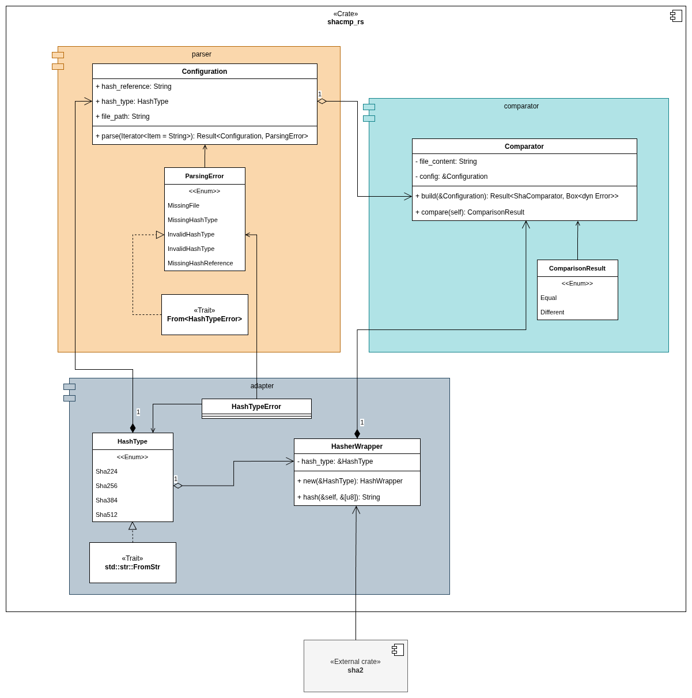

# shacmp_rs

[](https://github.com/alrapal/shacmp_rs/actions/workflows/rust.yml)

When downloading software from the internet, often applications provide with a checksum string to verify against a downloaded asset to ensure the integrity of that asset.

`shacmp_rs` is a CLI tool that allows to easily verify the checksums generated using the SHA algorithms.

## Usage

```sh
shacmp_rs <path to the file to process> <type of hashing algorithm> <checksum string reference>
```

## Supported algorithms

The algorithms used by this tool are provided by the `sha2` crate:
- Sha224
- Sha256
- Sha384
- Sha512

## Library
A library is also provided for whoever would like to reuse this wrapping and comparison functions.

### Architecture


